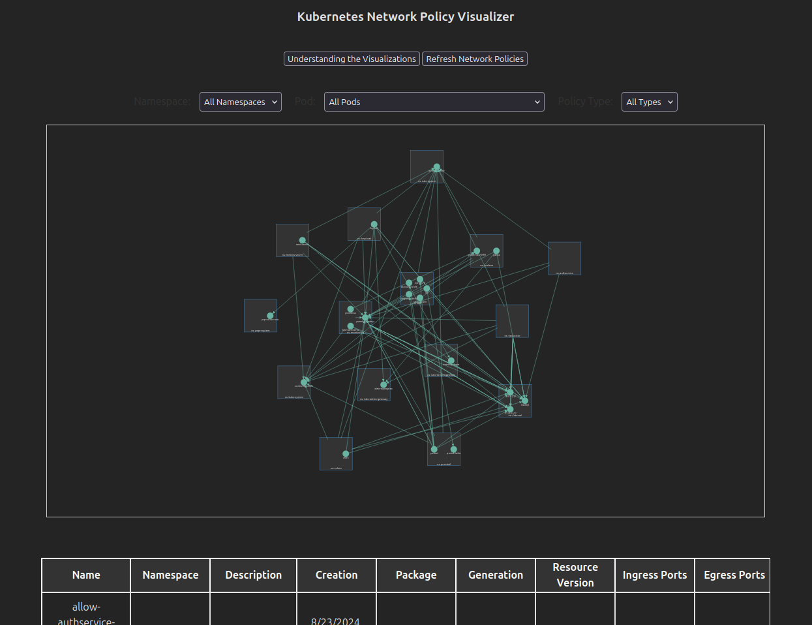

# Kubernetes Network Policy Visualizer

This project is a Svelte-based web application designed to visualize Kubernetes network policies. It provides a graphical representation of network policies and a tabular view, making it easier to understand and analyze how different pods and namespaces are connected in a Kubernetes cluster.

## Features

- **Graphical Visualization**: Visualize Kubernetes network policies using D3.js, representing pods and namespaces and their connections based on ingress and egress rules.

- **Tabular View**: A detailed table view that lists all network policies with associated metadata.

## Requirements

- **Node.js** (v16 or later)
- **Svelte** (v3.0 or later)
- **D3.js** (v7.0 or later)
- **TypeScript** (Optional but recommended for development)

## Installation

> [!WARNING]
>  A k8s running cluster will be required for live data to be viewable
> ```bash
>       # Stress test with a UDS Core cluster
>       # clone uds-core
>       git clone git@github.com:defenseunicorns/uds-core.gitj
>       cd uds-core
>
>       # create uds core cluster
>       uds run test-uds-core
>
>       # once the cluster is up, deploy the server and UI to see real data
>    ```

> [!TIP]
>  Don't want to use a live cluster?
>  Utilize this npm script after cloning the repo
> ```bash
>   # no server required, will run npm ci, and use mock data
>   npm run standalone
> ```

1. **Clone the repository**:
   ```bash
   git clone https://github.com/defenseunicorns-dashdays/network-visualizer.git
   cd network-visualizer
   ```
2. **Install dependencies:**
   ```bash
    npm install
   ```
3. **Run the development server:**
   ```bash
    npm run server
   ```
4. **Run UI:**
   ```bash
     npm run dev
   ```
5. **Build for production:**
   ```bash
    npm run build
   ```
6. **Preview the production build:**
   ```bash
    npm run preview
   ```

## Usage
1. Start the server: Run the development server using `npm run server`
2. Start the Svelte App: `npm run dev`
3. Open browser at: http://localhost:5137
4. **GLHF**
   1. Unsure where to start? Click the `Understanding the Visualizations` modal for more information

### What you'll see in browser
1. Fetch Network Policies: The application automatically fetches Kubernetes network policies from http://localhost:3000/api/network-policies and displays them visually and in a table.
2. `Understanding the Visualization`: Modal to describe the visualization and how to interact with it
3. `Refresh Network Policies`: Click to refresh the visualization with the latest cluster data
4. Icons ( **See the readme in the `src/validations` for in depth explanation**):
   1. `Green Checkmark`
      
   2. `Yellow Warning`
      
   3. `Red Exclamation`
      
5. Filters:
   1. `Namespaces`
   2. `Pods`
   3. `Policy Type`
6. Visualize Policies: The network policies will be visualized on a graph, showing the relationships between pods and namespaces.
7. View Details: The table view provides detailed information about each network policy, including ingress and egress rules.



## Limitations
* At the moment it's just namespace and pod related, need to include cluster and separate visualization for that
* Data Source: The application currently fetches data from http://localhost:3000/api/network-policies. This API endpoint needs to be set up separately to provide the correct data format.
* Browser Compatibility: The application is tested primarily on modern browsers like Chrome and Firefox. There might be issues with older browsers.
* Real-time Updates: The current version does not support real-time updates of network policies. Clicking refresh button or refreshing page is required.

## Future Issues
* Make allow v deny policies easier to understand
* Make hoverable namespace/pod show details
* Robustness of the table creation ( pretty statically typed at the moment )

## Looking to hire a UX designer